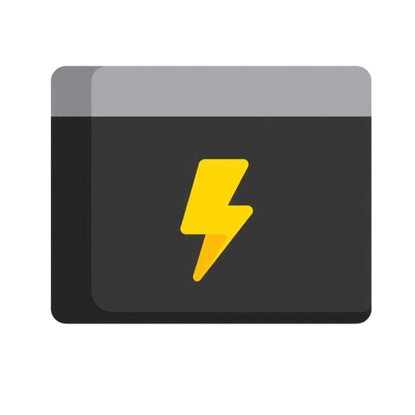

# broWorks Dev-Caddy ⛳



**Your Essential Developer Companion.**

Dev-Caddy is a high-performance, **local-first** dashboard designed to organize, execute, and manage your most used CLI commands, LLM prompts, and workflows. Built for developers who refuse to waste time digging through shell history.

## 🚀 Key Features

-   **⚡ Instant Access**: Global search (Ctrl+K) and category filtering.
-   **🧠 Smart AI Prompts**:
    -   **Dynamic Variables**: Write prompts like *"Refactor this code to `{Language}`"* and the UI automatically generates an input field for `Language`.
    -   **One-Click Copy**: Fill the variables and copy the compiled prompt instantly.
-   **📂 Advanced Organization**:
    -   **LIFO Ordering**: Newest items appear at the top for immediate access.
    -   **Drag & Drop**: Fully reorderable categories and commands via Edit Mode.
-   **🔒 100% Local Privacy**: Your data never leaves your machine.
-   **🛡️ Data Safety**:
    -   **Auto-Backup**: Passive backup to localStorage on every save.
    -   **Manual Export**: Download JSON backups for external storage.
-   **⌨️ Power User Shortcuts**:
    -   `Ctrl+K`: Focus search
    -   `Ctrl+Enter` / `Cmd+Enter`: Submit any form instantly
    -   `Esc`: Close any modal without saving
-   **🎨 Premium UX**:
    -   Sleek Dark Mode interface with custom aesthetics.
    -   AlertDialog confirmations for destructive actions (no browser alerts).
    -   Bottom-center toast notifications that don't obstruct UI.

## 🛠️ Tech Stack

-   **Framework**: [Next.js 14](https://nextjs.org/)
-   **Styling**: [Tailwind CSS](https://tailwindcss.com/) + [Shadcn UI](https://ui.shadcn.com/)
-   **Icons**: [Lucide React](https://lucide.dev/)
-   **State**: [Zustand](https://github.com/pmndrs/zustand)
-   **DnD**: [@dnd-kit](https://dndkit.com/)

## 📦 Installation

1.  **Clone the repository**:
    ```bash
    git clone https://github.com/pedropablo-dev/broworks-dev-caddy.git
    cd broworks-dev-caddy
    ```

2.  **Install dependencies**:
    ```bash
    npm install
    ```

3.  **Run Development Server**:
    ```bash
    npm run dev
    ```
    Open [http://localhost:3000](http://localhost:3000).

4.  **Build for Production**:
    ```bash
    npm run build
    npm start
    ```

## 📂 Project Structure

-   `app/`: App Router pages and global layouts.
-   `components/dev-caddy/`: Core business logic components (Cards, Sidebar, Forms).
-   `context/`: React Contexts (Toast system).
-   `hooks/`: Custom hooks for data handling (`use-commands`).
-   `store/`: Global UI state stores.
-   `public/`: Static assets and the `help.md` User Guide.

## 🤝 Contributing

See [CONTRIBUTING.md](docs/CONTRIBUTING.md) for guidelines.

---

**Built with ❤️ for speed.**