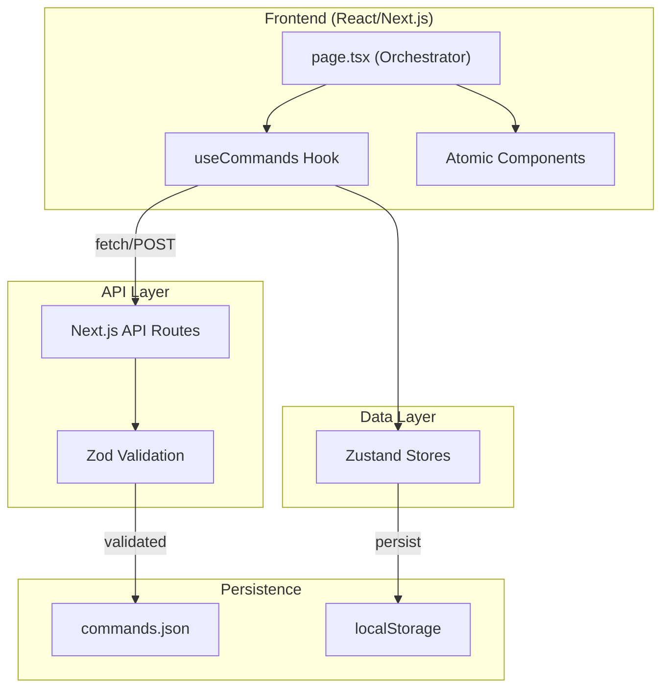
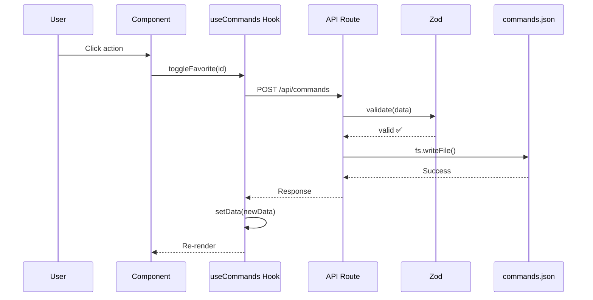

# Dev-Caddy Architecture v0.2.0

## Overview

Dev-Caddy is a personal command palette application. After the v0.2.0 refactor, it features:
- **Atomic component architecture** with clear separation of concerns
- **Custom hooks** for data management
- **Zod validation** for API security
- **Error boundaries** for resilience

---

## High-Level Architecture



---

## Drag & Drop Strategy (v0.3.0)

To support reordering of both Categories and Commands within a single `DndContext`, we use an **ID Prefix Strategy** to prevent collisions:

- **Categories:** `cat-${category.id}`
- **Commands:** `cmd-${command.id}`

The `handleDragEnd` function in `app/admin/page.tsx` checks these prefixes to determine which list is being reordered and executes the appropriate logic (updating `categories` array vs updating `commands[categoryId]` array).

---

## Component Architecture

### Atomic Design Pattern

```
components/dev-caddy/
├── Sidebar.tsx          # 190 lines - Category navigation / SortableContext
│   ├── SortableCategoryItem # Draggable category
│   ├── CategorySearch
│   ├── HelpDialog
│   └── AdminLink
│
├── Header.tsx           # 24 lines - Search bar
│   └── Ctrl+K input
│
├── CommandList.tsx      # 48 lines - ScrollArea wrapper
│   └── Maps CommandCard
│
├── CommandCard.tsx      # 205 lines - Command display
│   ├── SimpleCommand
│   ├── WorkflowCard
│   ├── PromptCard
│   └── VariablesForm
│
├── SortableCommandItem.tsx # Draggable command wrapper
│
├── skeletons.tsx        # 80 lines - Loading states
│   ├── SidebarSkeleton
│   ├── CommandListSkeleton
│   └── DashboardSkeleton
│
└── backup-controls.tsx  # 108 lines - Export/Import
    ├── handleExport
    └── handleImport
```

### Page Orchestration

```typescript
// app/page.tsx (160 lines - reduced from 483)
export default function BroworksLaunchpad() {
  // Data layer (hook)
  const { data, isLoading, hasMounted, toggleFavorite } = useCommands()
  
  // UI state only
  const [searchQuery, setSearchQuery] = useState("")
  
  // Loading state
  if (isLoading || !hasMounted) {
    return <DashboardSkeleton />
  }
  
  // Render atomic components
  return (
    <div>
      <Sidebar categories={...} />
      <Header searchQuery={...} onSearchChange={...} />
      <CommandList commands={...} onToggleFavorite={toggleFavorite} />
    </div>
  )
}
```

---

## Data Layer

### Custom Hook: useCommands

```typescript
// hooks/use-commands.ts (133 lines)
export function useCommands() {
  const [data, setData] = useState<AppData>({ categories: [], commands: {} })
  const [isLoading, setIsLoading] = useState(true)
  const [hasMounted, setHasMounted] = useState(false)

  const fetchData = useCallback(async () => { /* GET /api/commands */ }, [])
  const saveData = useCallback(async (newData: AppData) => { /* POST */ }, [])
  const toggleFavorite = useCallback((commandId: string) => { /* ... */ }, [data, saveData])
  const importData = useCallback(async (newData: AppData) => { /* restore */ }, [saveData])

  useEffect(() => { fetchData() }, [])

  return { data, isLoading, hasMounted, fetchData, saveData, toggleFavorite, importData }
}
```

**Benefits:**
- ✅ Single responsibility
- ✅ Reusable across pages
- ✅ Centralized error handling (toast)
- ✅ Memoized with useCallback

---

## API Validation Layer

### Zod Schemas

```typescript
// lib/schemas.ts
export const CommandSchema = z.object({
  id: z.string().min(1),
  label: z.string().min(1),
  command: z.string(),
  type: z.enum(['command', 'workflow', 'prompt']),
  isFavorite: z.boolean().optional(),
  order: z.number().optional(),
  variables: z.union([z.array(VariableSchema), z.array(z.string())]).optional(),
  steps: z.array(z.string()).optional()
});

export const AppDataSchema = z.object({
  categories: z.array(CategorySchema),
  commands: z.record(z.string(), z.array(CommandSchema))
});
```

### Validated API Route

```typescript
// app/api/commands/route.ts
export async function POST(request: Request) {
  const body = await request.json();
  const result = AppDataSchema.safeParse(body);
  
  if (!result.success) {
    return NextResponse.json(
      { message: "Validation failed", errors: result.error.flatten() },
      { status: 400 }
    );
  }
  
  // Safe to write validated data
  await fs.writeFile(filePath, JSON.stringify(result.data, null, 2));
}
```

---

## Error Handling

### Global Error Boundary

```typescript
// app/error.tsx
export default function Error({ error, reset }: ErrorProps) {
  useEffect(() => { console.error("Application error:", error) }, [error])
  
  return (
    <div>
      <AlertTriangle />
      <h1>Algo ha salido mal</h1>
      <Button onClick={reset}>Intentar de nuevo</Button>
    </div>
  )
}
```

### 404 Page

```typescript
// app/not-found.tsx
export default function NotFound() {
  return (
    <div>
      <h1>404</h1>
      <Link href="/"><Button>Volver al inicio</Button></Link>
    </div>
  )
}
```

---

## State Management

### Zustand Stores

| Store | Key | Purpose | Persistence |
|-------|-----|---------|-------------|
| `appStore` | `selectedCategory` | Current category in main view | localStorage |
| `appStore` | `adminSelectedCategory` | Current category in admin | localStorage |
| `uiStore` | `isSidebarCollapsed` | Sidebar toggle state | localStorage |

### Data Flow



---

## Type System

### Single Source of Truth

```typescript
// types/index.ts
export interface Variable {
  name: string;
  placeholder: string;
}

export interface Command {
  id: string;
  label: string;
  command: string;
  type: 'command' | 'workflow' | 'prompt';
  isFavorite?: boolean;
  order?: number;
  variables?: Variable[] | string[];
  steps?: string[];
}

export interface Category {
  id: string;
  name: string;
  icon: string;
  order?: number;
}

export interface AppData {
  categories: Category[];
  commands: Record<string, Command[]>;
}
```

---

## Key Dependencies

| Package | Version | Purpose |
|---------|---------|---------|
| `next` | 14.2.30 | Framework |
| `zustand` | 5.0.6 | State management |
| `zod` | 3.24.1 | API validation ✅ |
| `sonner` | 1.7.1 | Toast notifications |
| `lucide-react` | 0.454.0 | Icons |
| `@dnd-kit/core` | 6.x | Drag & Drop Logic |
| `@dnd-kit/sortable` | 8.x | Sortable Primitives |
| `fuse.js` | 7.0 | Fuzzy Search |
| `prism-react-renderer` | 2.x | Syntax Highlighting |
