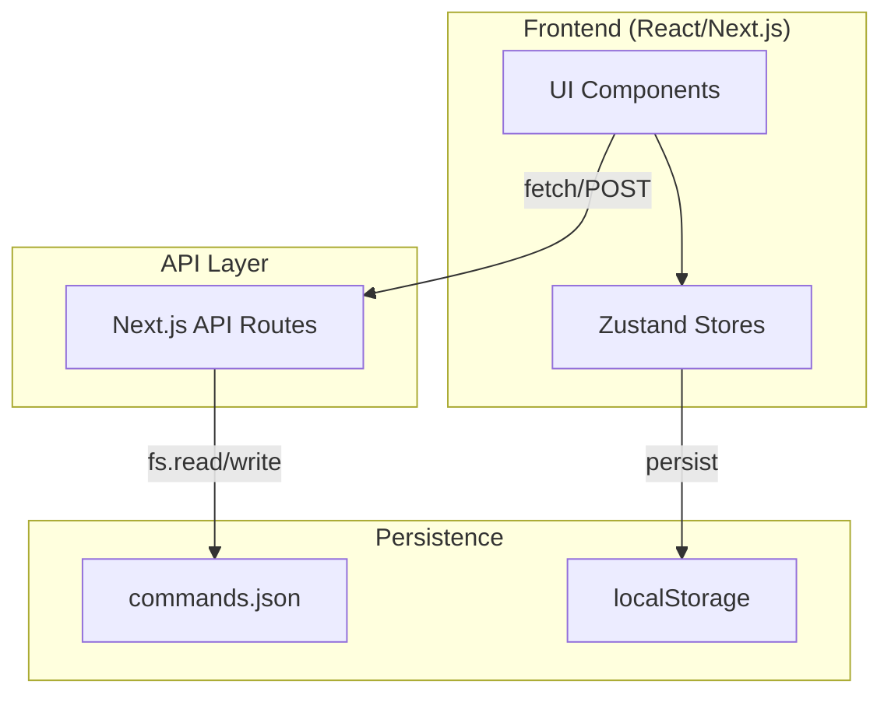
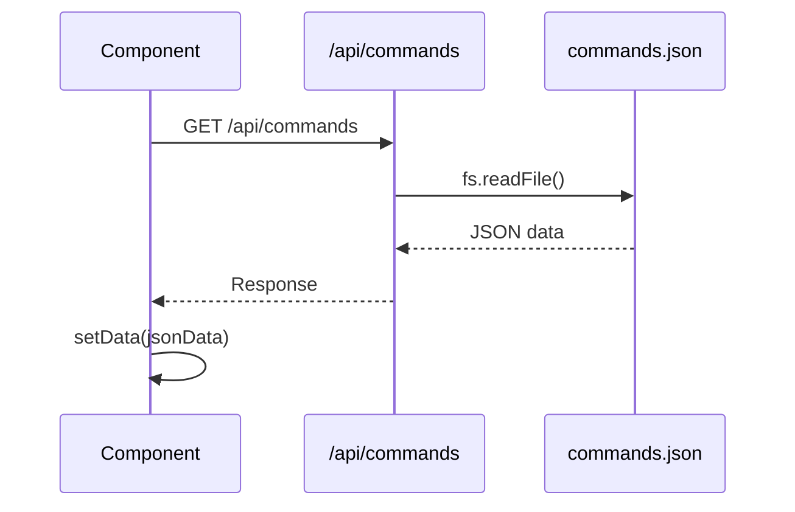
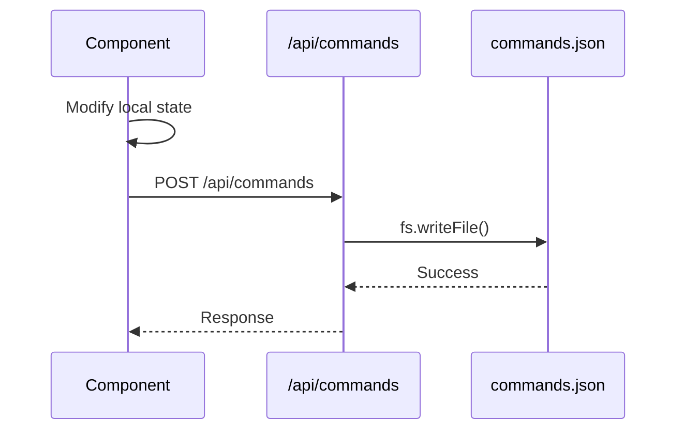

# Dev-Caddy Architecture

## Overview

Dev-Caddy is a personal command palette application for developers. It stores commands, workflows, and AI prompts organized by categories with localStorage-persisted UI state.

---

## High-Level Architecture



---

## Data Flow

### Read Flow


### Write Flow


---

## Component Hierarchy

```
app/
├── page.tsx              # Main launchpad (486 lines)
│   ├── Sidebar
│   │   ├── CategoryList
│   │   ├── CategorySearch
│   │   └── HelpDialog
│   └── MainPanel
│       ├── CommandSearch
│       └── CommandCards
│
├── admin/
│   ├── page.tsx          # Admin panel (398 lines)
│   │   ├── CategoryManager
│   │   ├── CommandManager
│   │   └── CRUD Dialogs
│   │
│   └── editor/
│       └── page.tsx      # Prompt editor (488 lines)
│           ├── Toolbar
│           ├── TextArea
│           └── VariablesPanel
│
└── api/
    └── commands/
        └── route.ts      # GET/POST handlers
```

---

## State Management

### Zustand Stores

| Store | Key | Purpose | Persistence |
|-------|-----|---------|-------------|
| `appStore` | `selectedCategory` | Current category in main view | localStorage |
| `appStore` | `adminSelectedCategory` | Current category in admin | localStorage |
| `uiStore` | `isSidebarCollapsed` | Sidebar toggle state | localStorage |

### Local Component State

Each page manages its own:
- `data: AppData` - Commands and categories
- `isLoading: boolean` - Loading state
- Form/dialog states for CRUD operations

---

## Data Model

```typescript
interface Category {
  id: string          // Unique slug
  name: string        // Display name
  icon: string        // Emoji icon
  order?: number      // Sort order
}

interface Command {
  id: string
  label: string       // Display name
  command: string     // Content/command text
  type: "command" | "workflow" | "prompt"
  isFavorite?: boolean
  order?: number
  variables?: Variable[] | string[]  // For templates
  steps?: string[]                   // For workflows
}

interface AppData {
  categories: Category[]
  commands: Record<string, Command[]>  // categoryId -> commands
}
```

---

## Key Dependencies

| Package | Version | Purpose |
|---------|---------|---------|
| `next` | 14.2.30 | Framework |
| `zustand` | 5.0.6 | State management |
| `zod` | 3.24.1 | Validation (installed, not used) |
| `sonner` | 1.7.1 | Toast notifications |
| `react-markdown` | 10.1.0 | Markdown rendering |
| `lucide-react` | 0.454.0 | Icons |
